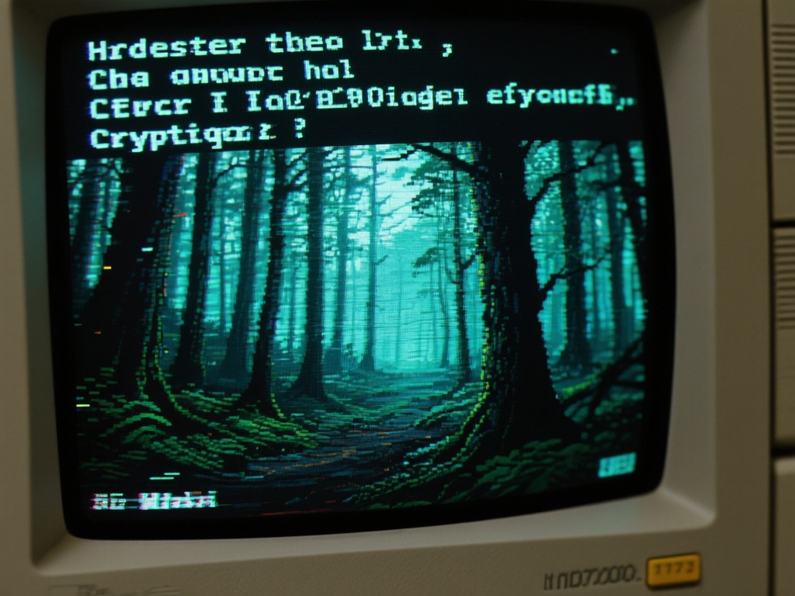
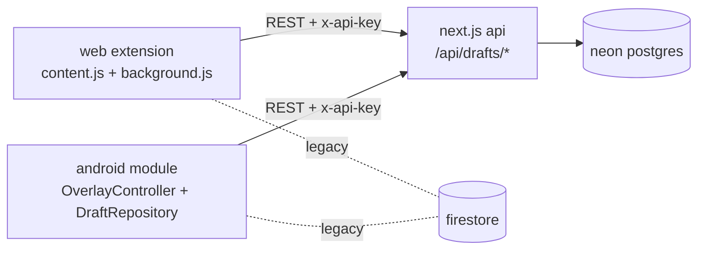

<p align="center">
  
</p>

<h1 align="center">GlitchDraft</h1>

<p align="center">
  save drafts per conversation, keep them on every device<br>
  <b>mv3 browser extension</b> · <b>lsposed android module</b> · <b>next.js + neon backend</b>
</p>

<p align="center">
  <a href="LICENSE"></a>
  
  
  
  
  <a href="https://glitchdraft.vercel.app"></a>
</p>

<table align="center">
  <tr>
    <td align="center" width="33%"><b>🧵 per-chat drafts</b><br>one row per conversation —<br>drafts never mix across chats</td>
    <td align="center" width="33%"><b>🔄 sync everywhere</b><br>start a reply on the phone,<br>finish it in the browser</td>
    <td align="center" width="33%"><b>🖼️ text + images</b><br>paste images into drafts too,<br>not just text</td>
  </tr>
  <tr>
    <td align="center"><b>📱 android overlay</b><br>floating draft panel inside<br>the chat apps themselves</td>
    <td align="center"><b>🕐 timestamps</b><br>created + modified times on<br>every card, on both platforms</td>
    <td align="center"><b>🔌 bring your own backend</b><br>your next.js + neon, or the<br>legacy firestore path</td>
  </tr>
</table>

## supported surfaces

| surface | web extension | android module |
| --- | --- | --- |
| messenger | ✅ | ✅ (native) |
| facebook messages | ✅ | ✅ (in-app webviews) |
| discord | ✅ | ✅ |
| whatsapp | ✅ (web) | ✅ (native) |
| instagram dm | ✅ | 🔧 hook landed, device test pending |

chat ids are scoped per conversation (`messenger_web_<fbid>_<name>` vs
`messenger_android_<thread>_<name>`, `instagram_web_<thread>_<name>`, …), and a
name-slug matcher bridges the two sides so the same conversation resolves to the
same drafts even though web and android derive ids differently.

## how it works



both clients speak the same small REST API. sync polling runs on a 10-second
tick and only while the panel/tab is visible, so an idle chat costs no backend
compute.

## quick start

### browser extension (edge / chrome)

1. clone the repo
2. open `edge://extensions` (or `chrome://extensions`), enable developer mode,
   **load unpacked** → pick the `extension/` folder
3. open a chat, click the extension icon or press <kbd>Alt</kbd>+<kbd>M</kbd>
4. to sync across devices, click the popup and paste your backend config:

   ```json
   {"apiBaseUrl": "https://your-backend.vercel.app", "apiKey": "your_api_key"}
   ```

### android module

1. `npm run android:run` — builds, installs and launches the app
   (needs adb; `tools/android.ps1` picks a JDK 21 on its own)
2. enable the module in your xposed framework (LSPosed / Vector) and scope it
   to the chat apps
3. grant **display over other apps**
4. open the GlitchDraft app and paste the same
   `{"apiBaseUrl": "...", "apiKey": "..."}` JSON
5. tap the floating icon inside a chat to open the panel

signed release builds: `npm run android:release:apk` (signing comes from
`GD_KEYSTORE_FILE` / `GD_KEYSTORE_PASSWORD` / `GD_KEY_ALIAS` env vars — the
build fails loudly instead of shipping an unsigned apk).

### backend

```bash
cd backend
pnpm install
# .env: DATABASE_URL=<neon postgres url>  API_KEY=<client api key>
pnpm dev
```

- every client request is authenticated with the `x-api-key` header set to
  `API_KEY`
- health check: `GET /api/health` with that header
- deploy anywhere node runs (vercel: set the project root to `backend/`)

## usage

- <kbd>Alt</kbd>+<kbd>M</kbd> toggles the panel (web); on android it's the
  floating icon
- type into the panel input and hit <kbd>+</kbd> / <kbd>Alt</kbd>+<kbd>S</kbd>
  to save a draft — it never touches the real composer until you say so
- per card: **use** (insert into the chat), **copy**, **edit**, **delete**
- the panel menu has **export all**, **import** and **sync now**
- cards show when the draft was written and a `Modified:` line when it was
  changed later from another device

## legacy firestore path

the extension and module can also sync through a personal firestore instead of
the backend above — paste the firebase config JSON into the same popup / app
screen. if you go that route, tighten the firestore rules (the permissive
version below is for a throwaway test project only):

```
rules_version = '2';
service cloud.firestore {
  match /databases/{database}/documents {
    match /drafts/{document=**} {
      allow read, write: if true;
    }
    match /settings/{document=**} {
      allow read, write: if true;
    }
  }
}
```

**Important**: these rules allow anyone to read/write your data. For production, add proper authentication.

## comparison

| Capability | GlitchDraft | [Form History Control II](https://chromewebstore.google.com/detail/form-history-control-ii/lpcccgcdjibejkgiaeijbmkpbnbkglkb) | [Textarea Cache](https://addons.mozilla.org/en-US/firefox/addon/textarea-cache/) | [Form Recover](https://formrecover.com/) / Form Recovery | [Typio Form Recovery](https://typiorecovery.github.io/) | Built-in chat drafts |
| --- | --- | --- | --- | --- | --- | --- |
| Chat-thread-specific saved drafts | ✅ | - | - | partial | partial | partial |
| Generic form/text-area autosave | partial | ✅ | ✅ | ✅ | ✅ | - |
| Restore/search/edit form history | partial | ✅ | ✅ | ✅ | ✅ | - |
| Messenger/Discord/WhatsApp-focused adapters | ✅ | - | - | - | - | partial |
| Image/media draft support | partial | - | - | - | - | partial |
| Cross-device/backend sync | ✅ | partial | - | - | - | platform-dependent |
| Android/WebView or LSPosed overlay path | ✅ | - | - | - | - | platform-dependent |
| Bring-your-own backend | ✅ | - | - | - | - | - |
| Local-only privacy by default | partial | ✅ | ✅ | ✅ | ✅ | platform-dependent |
| Open-source, self-modifiable stack | ✅ | partial | ✅ | partial | partial | - |

General form-recovery extensions are stronger at broad autosave, search, cleanup, export/import,
and one-click field injection. GlitchDraft is narrower but reaches a different problem: chat
drafts tied to conversations, plus Android/WebView-style surfaces where normal browser form
history tools do not reach.

The obvious backlog is a safer auth model, better generic form support, cleaner import/export,
stronger image draft handling, and a simpler production setup story.

## repo layout

| path | what |
| --- | --- |
| `extension/` | mv3 browser extension, plain js, no build step |
| `android/` | lsposed module (kotlin) + injected webview assets |
| `backend/` | next.js REST api + drizzle on neon |
| `userscript/` | lightweight browser injection experiment |
| `tools/` | `reload-extension.ps1`, `android.ps1` helpers |
| `AGENTS.md` | working notes: gotchas, cross-platform contracts, deploy steps |

## development

- **extension** — edit `extension/*.js` raw, bump `version` in
  `extension/manifest.json` in the same change, then
  `pwsh tools/reload-extension.ps1`
- **android** — `npm run android:run` (debug), `npm run android:build:release`,
  `npm run android:release:apk`
- **backend** — `pnpm dev` inside `backend/`
- `draftSync.js`, `draftImport.js` and `styles.css` exist byte-identical in both
  `extension/` and `android/app/src/main/assets/glitchdraft/` — copy your edit
  across. `content.js` is forked on purpose (native-overlay glue on the android
  side); its shared call contract with draftSync must change in both files.

## contributors

<a href="https://github.com/FahadBinHussain/glitchdraft/graphs/contributors">
  
</a>

## license

[MIT](LICENSE)
